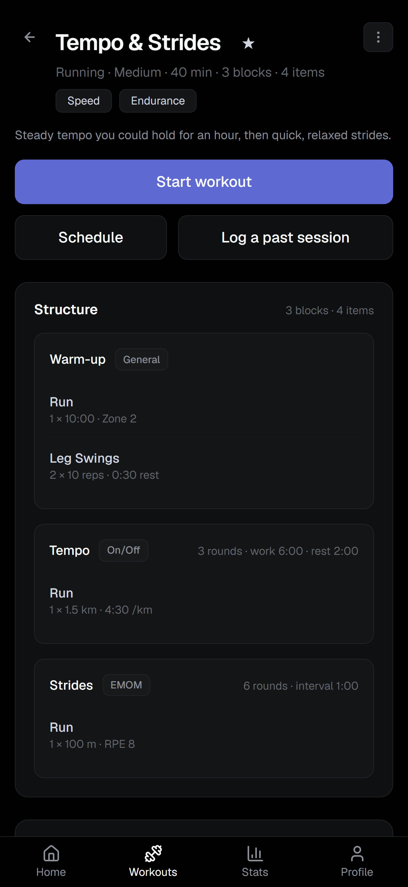
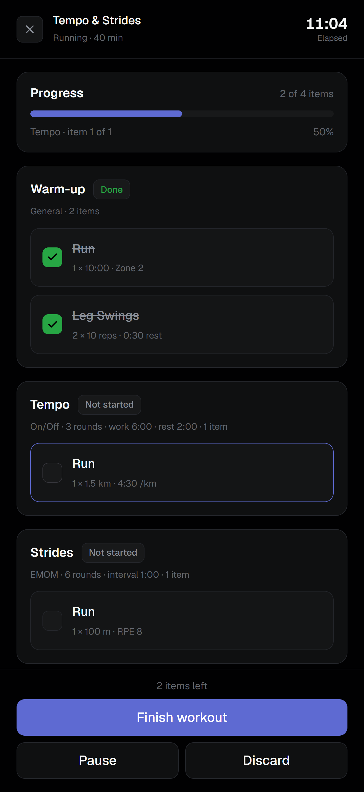
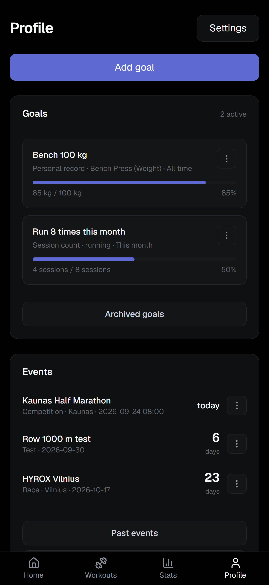

# GoHybrid

A training hub for hybrid athletes — build workouts, plan your week, and track progress across running, strength and HYROX.

**Live:** [gohybrid.vercel.app](https://gohybrid.vercel.app)

Hybrid athletes train across disciplines that most trackers treat separately: a week might hold an interval run, a barbell session, a HYROX simulation and a conditioning circuit. GoHybrid models all four in one structure, then answers the three questions that come up daily — what am I doing today, what did I do, and am I getting better.

---

## Screenshots

<p align="center">
  
</p>
<p align="center">
  
</p>
<p align="center">
  
  
  
  
</p>

---

## What it does

**Build.** A workout is a template of blocks and items, each block with a methodology (`for_time`, `on_off`, `amrap`, `emom`, `general`) that sets its timing fields. Blocks and items edit in a modal draft — Save commits, closing discards — gated by a checklist derived from the same validator the server runs.

**Plan.** Home is the single planning surface: a week strip and a month calendar share one selected day and one browsing anchor, so paging never changes which day's cards are open — only clicking a day does. Workouts and optional-time events schedule here too. Nothing schedules into the past: a planned entry reschedules instead, and an already-done workout logs via Log a past session.

**Follow.** Start is a full-screen focus page: the clock starts on open, with Pause/Resume, and Finish records only the active duration. Progress persists in `localStorage` for up to 12 hours but is invalidated the moment the workout is edited.

**Analyse.** Finishing a workout writes a session, snapshotting title, type and, from Start, an active duration. That session drives a heatmap, weekly volume, discipline distribution and streaks. Progress charts read only personal records and body metrics, never sessions, which record at most how long a workout took, not how it went.

**Personalise.** Goals with four target sources and derived progress, per-user timezone, and metric/imperial units converted at the display boundary — HYROX station distances stay metric.

---

## Tech stack

| | |
|---|---|
| Framework | Next.js (App Router), TypeScript |
| Styling | Tailwind CSS v4, Geist (`next/font/google`) |
| Database | Supabase PostgreSQL |
| ORM | Drizzle |
| Auth | Supabase Auth |
| Backend | Server Actions and Route Handlers |
| Drag and drop | `@dnd-kit` |
| Charts | Hand-drawn SVG, Recharts where it earns its weight |
| Hosting | Vercel |

---

## Architecture

### Authorization without RLS

Row Level Security is disabled, deliberately. Drizzle connects to Postgres through Supabase's connection poolers, not the Supabase client — there's no JWT for `auth.uid()` to read, so every RLS policy would see a null user and block everything.

Authorization is therefore application-level, structured so it cannot be forgotten rather than merely remembered:

- Every Drizzle query touching a user-owned table lives in `lib/`, in a function that takes `userId` as a **required** parameter and filters on it.
- Every Server Action resolves the user itself with `requireUser()`. An id arriving as an action argument is a target, never an actor.
- Route Handlers return `404`, never `403`, for another user's resource — a `403` confirms the id exists and lets an attacker enumerate.

Nested tables carry no `user_id`: `workout_blocks` and `workout_items` are only reached through an owner-filtered `workouts` row, and writes roll back inside a transaction if the ownership check fails.

### Two connection modes

| Environment | Pooler | Port | Why |
|---|---|---|---|
| Local dev, migrations | Session | 5432 | Direct connections are IPv6-only; session mode supports the DDL and prepared statements migrations need |
| Production | Transaction | 6543 | Serverless functions open many short-lived connections; transaction mode returns each to the pool immediately |

Vercel functions run in `dub1` (Dublin), the same AWS region as the database — the default `iad1` put every round trip across the Atlantic, costing three to five times the render time on pages issuing dozens of them.

The driver is `node-postgres`, not `postgres.js`, which pipelines queries onto a shared socket — sending a second query before the first is answered — and Supavisor's transaction mode mishandles that: the backend sits in `ClientRead` until `statement_timeout` cancels it with `57014`, a hang rather than an error. `pg` checks a connection out per query and returns it when the result arrives, exactly what transaction mode expects; the same query through it returned in ~50ms. Migrations always run locally, never from Vercel.

The pool caps at 5 connections — Supabase allows 15, and each Vercel instance opens its own pool — with two client-side bounds: `query_timeout: 10_000` rejects a hung request after 10 seconds, and `connectionTimeoutMillis: 10_000` bounds the wait for a free connection. Neither reaches Postgres itself: the pooler drops startup parameters, so server-side `statement_timeout` stays Supavisor's 2-minute default, and `query_timeout` only stops waiting on the response without cancelling the backend query.

### Time is the hard part

Calendar days and instants are different types, and mixing them produces bugs that only appear near midnight.

- `scheduled_date`, `measured_at`, `achieved_at` and `event_date` are `date` columns: a scheduled workout is a day, not a moment, and storing it as `timestamptz` would put midnight in Vilnius on the previous day in UTC, rendering on the wrong square.
- `scheduled_time` and `events.event_time` sit beside their date columns as an optional local wall-clock `time` — informational only, never part of day bucketing or session linking. A null `event_time` means an all-day event.
- `workout_sessions.completed_at` is the schema's only genuine instant.
- Day bucketing happens in SQL with `AT TIME ZONE`, never in JavaScript. A session finished at 23:30 local is already tomorrow in UTC.
- `getUserContext`, wrapped in React's `cache()`, is the single source for "which timezone" and "what day is it today" — resolving them separately once misaligned the heatmap's today-cell and its filled cells.

Two users in different timezones legitimately see different streaks for the same sessions — that's what per-user timezones mean, not a bug to patch.

### Validation in one place, enforced in another

Digit limits are named constants in `lib/numeric-limits.ts`, one per field, so changing a rep limit can't silently move a round limit. Text limits differ: `lib/text-limits.ts` defines three shared tiers (`NAME`/`SHORT` at 60 characters, `LONG` at 300) that every text field maps onto.

Each limit applies twice. The input corrects the value while it's typed: out-of-range numbers clamp, `-` and `e` never reach the field, redundant zeros collapse. The validator is the real gate, running server-side for every path including the REST routes. A column type is the last line of defence — a `varchar` overflow crashes the page, while a named constant produces a message.

### The REST routes are a second front door, not the one the UI uses

`app/api/` exposes workouts, scheduled workouts and sessions over plain HTTP — authenticated, JSON in and out, 401 on a missing session, 404 rather than 403 on someone else's resource. It calls the same `lib/` functions and validators the pages use, so the two surfaces can't drift apart. Nothing in `app/` calls it, though: pages call `lib/` directly and mutations go through Server Actions, skipping the network hop Route Handlers can't avoid. The routes stay as the demonstrated HTTP API — what a mobile client or script would integrate against.

### Feedback that survives navigation

An edit that redirects unmounts the form that would have shown "Saved." The banner instead travels in the URL as `?saved=<value>.<nonce>` — the nonce distinguishes two identical saves, since React won't remount a page just for a search-param change. The redirect target must be a same-site path, re-checked after each of up to three percent-decodes so an encoded `//` or `\` can't slip through.

### The builder writes atomically

Builder state lives on the client until Save, so a half-built workout can't exist in the database — no `draft` column to explain. The whole tree (workout, blocks, items, tags) writes in one `db.transaction()`; editing replaces the tree rather than diffing it, since blocks and items have no identity of their own.

### The design system

Design runs on a small, dark-only token set: layered `surface`/`hairline` tokens instead of shadows, one `accent` colour for the page's one primary action and data point, and five radius tokens instead of pixel values.

---

## Database

Thirteen tables. The shape worth knowing:

```
workouts ──┬──< workout_blocks ──< workout_items >──┐
           │                                        │
           ├──< workout_tags >── tags               └── exercises ──┬──< personal_records
           │                                                        └──< goals (optional)
           └──< scheduled_workouts >── workout_sessions

events (races, tests) · body_metrics (measurements) · user_settings (timezone, units) — standalone, keyed to the user

A ──< B: one A, many B (B holds the foreign key). A >── B: the same relation, read from the many side.
```

Three modelling decisions carry most of the weight:

**A workout is a template; a session is a separate, lightweight record of completion.** Sessions snapshot title, type and — for Start-flow sessions — an active duration (`duration_seconds`, pauses excluded); history survives template edits or deletion, since a session's own `workout_id` goes null rather than the row disappearing. No `status` column: existence is completion.

**One row per measurement, not one column per metric.** `body_metrics` has `metric_type` and `value` rather than separate `weight`/`body_fat`/`resting_hr` columns, so a new metric is an enum value, not a migration. `workout_items` uses the same shape for volume.

**Per-type columns, validated per type.** `workout_blocks`'s five timing columns and `goals`'s five `target_*` columns are each filled only for their own type; every structured column stays nullable, with which ones a type requires enforced in application code.

Migrations are generated with `drizzle-kit generate`, reviewed by hand and committed; `drizzle-kit push` is never used.

---

## Running locally

**Requirements:** Node 20.9 or newer (Next 16's minimum), and a Supabase project.

```bash
git clone https://github.com/AD0MAS/gohybrid.git
cd gohybrid
npm install
```

Create `.env.local`:

```bash
# Supabase project settings → API
NEXT_PUBLIC_SUPABASE_URL=https://<project-ref>.supabase.co
NEXT_PUBLIC_SUPABASE_ANON_KEY=<anon key>

# Supabase project settings → Database → Connection string → Session pooler (port 5432)
DATABASE_URL=postgresql://postgres.<project-ref>:<password>@<host>:5432/postgres

# Used as metadataBase for Open Graph, and as the origin the email
# confirmation link points at (${NEXT_PUBLIC_SITE_URL}/login?confirmed=1);
# localhost is fine for development
NEXT_PUBLIC_SITE_URL=http://localhost:3000
```

Apply the schema and seed the catalogs:

```bash
npx drizzle-kit migrate
npm run db:seed
```

Then:

```bash
npm run dev
```

Enable **Confirm email** (Authentication → Sign In / Providers → Email), and add both `http://localhost:3000/login?confirmed=1` and its production equivalent to the redirect URLs (Authentication → URL Configuration).

### Scripts

| | |
|---|---|
| `npm run dev` | Development server |
| `npm run build` | Production build |
| `npm start` | Serve the build |
| `npm run lint` | ESLint |
| `npx tsc --noEmit` | Type check |
| `npx drizzle-kit generate` | Generate a migration |
| `npx drizzle-kit migrate` | Apply pending migrations |

---

## Project structure

```
app/        routes, pages, Server Actions, Route Handlers — the UI and HTTP surface
lib/        auth helpers, data access, validation — the business logic
db/         schema.ts, enums.ts, relations, migrations, seed
public/     static assets
```

Dependencies run one way: `app → lib → db`. A client-imported module must never reach `db/index.ts` (the `pg` driver is Node-only) or import `db/schema.ts` at runtime — client code reads enums from `db/enums.ts` instead. Only `next build` catches a violation.

---

## Context

The third of four portfolio projects, and the first full-stack one — the step from "builds interfaces" to "designs a schema, writes an API, authenticates a user and ships the result."

UX patterns come from [Roxfit](https://roxfit.app) and the visual language from Linear's dark palette — neither copied. The app deliberately has no AI-generated workouts, no social feed and no race results — it does one thing.

---

## License

MIT. See [LICENSE](LICENSE).
