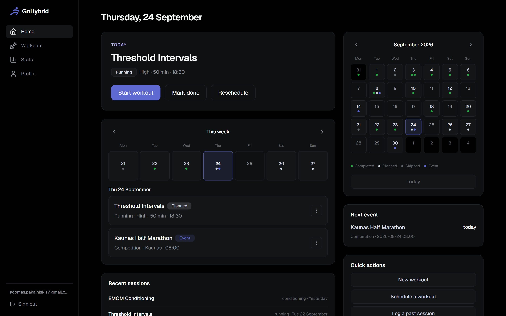
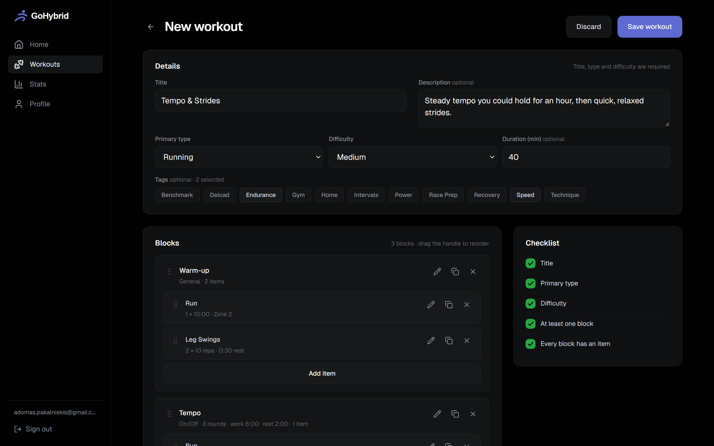
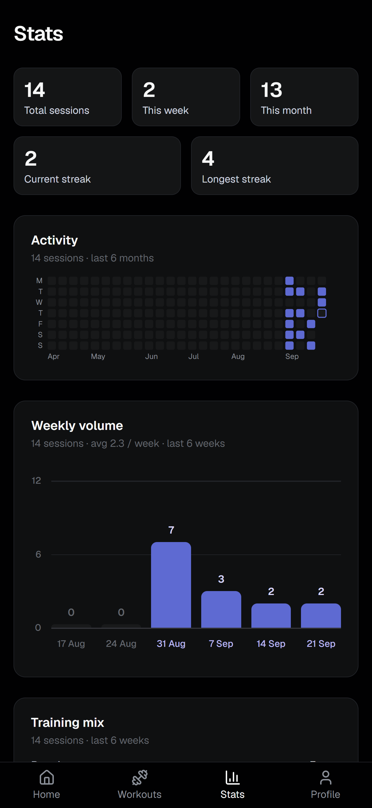
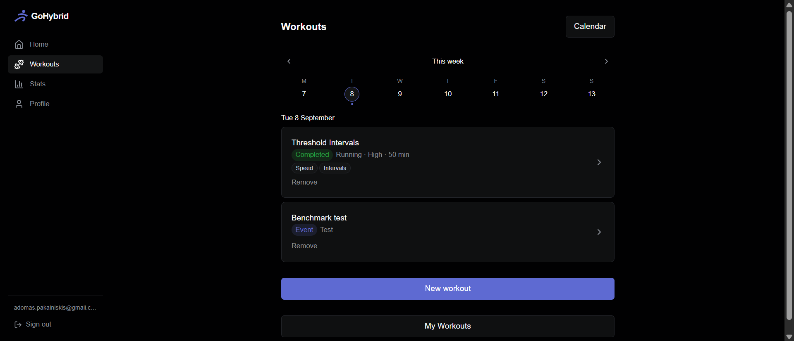

# GoHybrid

A training hub for hybrid athletes — build workouts, plan your week, and track progress across running, strength and HYROX.

**Live:** [gohybrid.vercel.app](https://gohybrid.vercel.app)

Hybrid athletes train across disciplines that most trackers treat separately: a week might hold an interval run, a barbell session, a HYROX simulation and a conditioning circuit. GoHybrid models all four in one structure, then answers the three questions that actually come up — what am I doing today, what did I do, and am I getting better.

---

## Screenshots

| Home | Workout builder |
|---|---|
|  |  |

| Stats | Weekly planning |
|---|---|
|  |  |

---

## What it does

**Build.** A workout is a template made of blocks, and a block is made of items. Each block carries a training methodology — `for_time`, `on_off`, `amrap`, `emom` or `general` — and only the timing fields that methodology needs. Each item points at a catalog exercise or carries its own name, with sets, volume, an intensity target, weight, rest and notes.

**Plan.** Schedule a workout on a calendar day, with or without a time. A week strip covers the days you look at daily; a month grid covers the ones you glance at. Races and tests live alongside them.

**Follow.** Start Workout mode is a full-screen checklist. Progress is held in `localStorage` and stamped with the workout's `updated_at`, so a phone locking mid-session loses nothing — and an edit made between sessions discards stale checkmarks rather than landing them on different items.

**Analyse.** Finishing a workout writes a session. Sessions drive a GitHub-style activity heatmap, weekly volume, distribution by discipline, and streaks. Progress charts are sourced only from manually entered personal records and body metrics — never from sessions, which record that a workout happened, not how it went.

**Personalise.** Goals with four target sources and derived progress. Per-user timezone. Metric or imperial, converted at the display boundary, with HYROX station distances locked to metres.

---

## Tech stack

| | |
|---|---|
| Framework | Next.js (App Router), TypeScript |
| Styling | Tailwind CSS v4 |
| Database | Supabase PostgreSQL |
| ORM | Drizzle |
| Auth | Supabase Auth |
| Backend | Next.js Server Actions and Route Handlers |
| Charts | Hand-drawn SVG, plus Recharts where it earns its weight |
| Hosting | Vercel |

---

## Architecture

### Authorization without RLS

Row Level Security is disabled, deliberately. Drizzle connects to Postgres over its own connection through Supabase's connection poolers, not through the Supabase client — so there is no JWT for `auth.uid()` to read, and every RLS policy would evaluate against a null user and block everything.

Authorization is therefore application-level, and structured so that it cannot be forgotten rather than merely remembered:

- Every Drizzle query touching a user-owned table lives in `lib/`, in a function that takes `userId` as a **required** parameter and filters on it.
- Every Server Action resolves the user itself with `requireUser()`. An id arriving as an action argument is a target, never an actor.
- Route Handlers return `404`, never `403`, for another user's resource — a `403` confirms the id exists and lets an attacker enumerate.

Nested tables carry no `user_id` of their own: `workout_blocks` and `workout_items` are only ever reached through a `workouts` row already filtered by owner, and writes happen inside a transaction that rolls back if the ownership check finds nothing.

### Two connection modes

| Environment | Pooler | Port | Why |
|---|---|---|---|
| Local dev, migrations | Session | 5432 | Direct connections are IPv6-only; session mode supports the DDL and prepared statements migrations need |
| Production | Transaction | 6543 | Serverless functions open many short-lived connections; transaction mode returns each to the pool immediately |

Vercel functions run in `dub1` (Dublin), the same AWS region as the database. The default `iad1` put every round trip across the Atlantic, which on pages issuing dozens of them cost three to five times the render time.

The driver is `node-postgres`, not `postgres.js`. The latter pipelines queries
onto a shared socket — it will send a second query before the first is answered
— which Supavisor's transaction mode mishandles: the backend sits in `ClientRead`
until `statement_timeout` cancels it with `57014`, surfacing as a request that
hangs rather than an error. `prepare`, `fetch_types`, `max` and `max_pipeline`
made no difference; the same query through `node-postgres` on the same pooler
returned in ~50ms. `pg` checks a connection out per query and returns it when the
result arrives, which is exactly what transaction mode expects. Migrations always
run locally, never from Vercel.

### Time is the hard part

Calendar days and instants are different types, and mixing them produces bugs that only appear near midnight.

- `scheduled_date`, `measured_at`, `achieved_at` and `event_date` are `date` columns. A scheduled workout is a day, not a moment; stored as `timestamptz`, midnight in Vilnius is the previous day in UTC and renders on the wrong square.
- `workout_sessions.completed_at` is the schema's only genuine instant.
- Day bucketing happens in SQL with `AT TIME ZONE`, never in JavaScript. A session finished at 23:30 local is already tomorrow in UTC.
- `getUserContext`, wrapped in React's `cache()`, is the single source for both "which timezone" and "what day is it today" — resolving them separately once put the heatmap's today-cell and its filled cells in different frames.

Two users in different timezones legitimately see different streaks for the same sessions. That is what per-user timezones mean, not a bug to patch.

### Validation in one place, enforced in another

Numeric and text limits are named constants in `lib/numeric-limits.ts` and `lib/text-limits.ts` — one per field, never shared across unrelated subjects, so changing a rep limit cannot silently move a session-count goal.

Each limit is applied twice, at different jobs. The input corrects the value while it is typed: out-of-range numbers clamp, `-` and `e` never reach the field, redundant zeros collapse. The validator is the gate: it runs server-side for every path including the REST routes, which never see an input. A column type is the last line of defence, not the first — a `varchar` overflow surfaces as a page-level crash, while a named constant produces a message.

### The builder writes atomically

Builder state lives entirely on the client until Save, so a half-built workout cannot exist in the database and there is no `draft` status column to explain. The whole tree — workout, blocks, items, tags — is written in one `db.transaction()`. Editing replaces the tree rather than diffing it: blocks and items have no independent identity, and nothing references them.

---

## Database

Thirteen tables. The shape worth knowing:

```
exercises ──┬─< workout_items >── workout_blocks >── workouts ──< workout_tags >── tags
            │                                            │
            └─< personal_records                         ├──< scheduled_workouts >── workout_sessions
                                                         └──────────────────────────────┘
goals   events   body_metrics   user_settings
```

Three modelling decisions carry most of the weight:

**A workout is a template; a session is a separate, lightweight record of completion.** Sessions snapshot the workout's title and type, so history survives the template being renamed or deleted. There is no `status` column — the session's existence *is* the completion.

**One row per measurement, not one row per column.** `body_metrics` has `metric_type` and `value` rather than `weight`, `body_fat` and `resting_hr` columns. Adding a metric is an enum value, not a migration, and the progress charts filter by type instead of knowing column names. `workout_items` uses the same shape for volume.

**Per-type columns, validated per type.** `workout_blocks` has five timing columns and `goals` has five `target_*` columns; each is filled only for its own type, and which ones a given type requires is application-level validation. Every structured column is nullable in Postgres, because conditional rules belong where they can produce a message.

Migrations are generated with `drizzle-kit generate`, reviewed by hand, and committed. `drizzle-kit push` is never used.

---

## Running locally

**Requirements:** Node 18.18 or newer, and a Supabase project.

```bash
git clone https://github.com/AD0MAS/gohybrid.git
cd gohybrid
npm install
```

Create `.env.local`:

```bash
# Supabase project settings → API
NEXT_PUBLIC_SUPABASE_URL=https://<project-ref>.supabase.co
NEXT_PUBLIC_SUPABASE_ANON_KEY=<anon key>

# Supabase project settings → Database → Connection string → Session pooler (port 5432)
DATABASE_URL=postgresql://postgres.<project-ref>:<password>@<host>:5432/postgres

# Used as metadataBase for Open Graph; localhost is fine for development
NEXT_PUBLIC_SITE_URL=http://localhost:3000
```

Apply the schema and seed the exercise and tag catalogs:

```bash
npx drizzle-kit migrate
npm run db:seed
```

Then:

```bash
npm run dev
```

In Supabase, enable **Confirm email** under Authentication → Sign In / Providers → Email, and add `http://localhost:3000/**` to the redirect URLs under Authentication → URL Configuration.

### Scripts

| | |
|---|---|
| `npm run dev` | Development server |
| `npm run build` | Production build |
| `npm start` | Serve the production build |
| `npm run lint` | ESLint |
| `npx tsc --noEmit` | Type check |
| `npx drizzle-kit generate` | Generate a migration from schema changes |
| `npx drizzle-kit migrate` | Apply pending migrations |

---

## Project structure

```
app/        routes, pages, Server Actions, Route Handlers — the UI and HTTP surface
lib/        auth helpers, data access, validation — the business logic
db/         Drizzle schema, relations, migrations, seed
public/     static assets
```

Dependencies run one way: `app → lib → db`. A `lib/` module imported by a client
component must never reach `db/index.ts`, since the `pg` driver is Node-only — a
rule neither `tsc` nor ESLint catches, only `next build`.

---

## Context

The third of four portfolio projects, and the first full-stack one — the step from "builds interfaces" to "designs a schema, writes an API, authenticates a user and ships the result."

UX patterns were studied from [Roxfit](https://roxfit.app) and adapted; the visual language is adapted from Linear's dark palette. Neither is copied. The app deliberately has no AI-generated workouts, no social feed and no race results — it does one thing.

---

## License

MIT. See [LICENSE](LICENSE).
